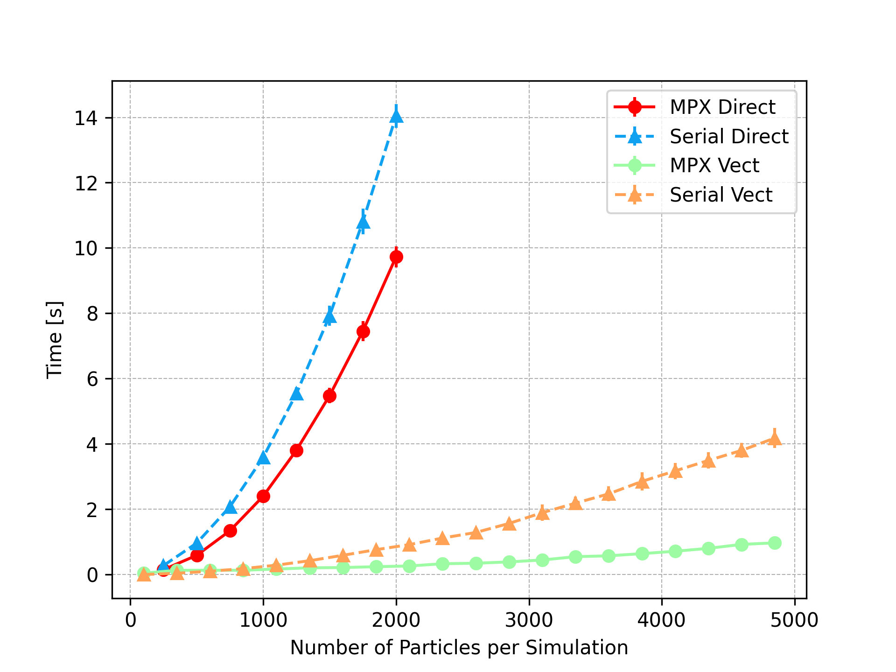

# Fireworks - N-Body simulations Python library

Fireworks is a Python package developed in the context of the Computational Astrophysics course at the University of Padova (2023-2024). 

It contains all the functions needed to run N-Body simulations. This repository contains:

* Docker image with the required packages.
* `Fireworks` package: install it by running `pip install fireworks`
* `project` folder: here you can find the final group project for the exam. It consists in three parts: CPU optimization, GPU optimization, Plummer Sphere simulation. I personally worked on the CPU optimization part.

## CPU Optimization - Final project summary

In this project, we assess different methods to optimize N-body simulations with Python on CPU.
This task is approached in two ways: 
1.  Optimizing the computation of accelerations, for a given single simulation;

2. Optimizing independent simulations run in parallel.

For the first approach we use the built-in `multiprocessing` and the external `numba` library, while for the second only the former is considered. 

We find a significant speed-up of the code in both cases, even though optimization fails when we try to mix the two methods, i.e. when running multiple independent simulations, while computing the accelerations in an optimized fashion.

You can find more informations in the `project` folder.

    <figure>
        
        <figcaption>Using multiprocessing (MPX) speeds up the computation of the acceleration for both the serial (two nested for loops) and vectorized (exploiting Numpy's broadcasting) functions.</figcaption>
    </figure>

## How to use Fireworks

After running `pip install fireworks` you can start running your first N-Body simulations. All functions are well documented, so take a look at them. A brief recap:

* `fireworks.ic` : This module contains functions and utilities to generate initial conditions for the Nbody simulations. Each function/class returns an instance of the class :class:`~fireworks.particles.Particles`

* `fireworks.particles` : Main class used to store Nbody particles data.

* `fireworks.nbodylib`: It contains the core functions needed to carry on a N-Body simulation:

    * `fireworks.nbodylib.dynamics` : This module contains a collection of functions to estimate acceleration due to gravitational forces.

    * `fireworks.nbodylib.integrators` : This module contains a collection of integrators to integrate one step of the ODE N-body problem.
    
    * `fireworks.nbodylib.nutits` : This module contains functions and utilities to deal with N-body units and units conversion.

    * `fireworks.nbodylib.potentials` : This module contains a collection of classes and functions to estimate acceleration due to gravitational  forces of a fixed potential.

    * `fireworks.nbodylib.timesteps` : This module contains functions and utilities to estimate the timestep for the Nbody integrations.

