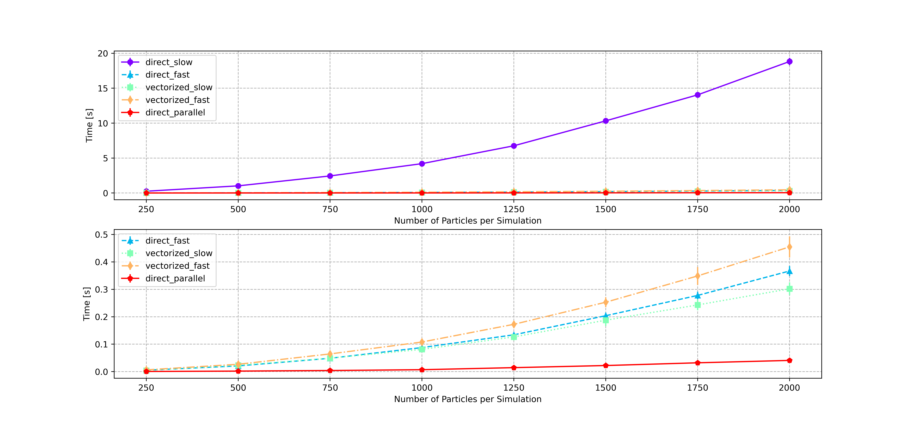
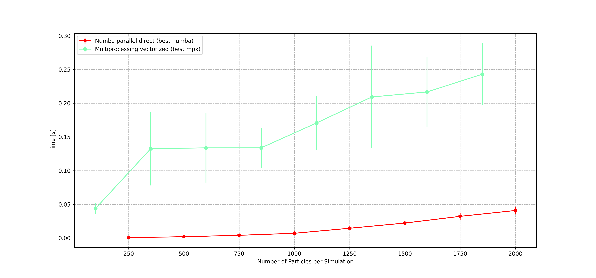

Here I copy-paste almost all the report relative to the CPU Optimization part. You can find the original notebook in the Reports folder. You can find the actual full scripts used to run the optimizations in the folder called `attachments_report_cpu_optimization`.

# Cpu optimization

In this section, we assess different methods to optimize N-body simulations with Python on CPU.
This task is approached in two ways: 
1.  Optimizing the computation of accelerations, for a given single simulation;

2. Optimizing independent simulations run in parallel.

For the first approach we use the built-in `multiprocessing` and the external `numba` library, while for the second only the former is considered. 

We find a significant speed-up of the code in both cases, even though optimization fails when we try to mix the two methods, i.e. when running multiple independent simulations, while computing the accelerations in an optimized fashion.

## Using all cores in a single simulation
Modern CPUs come with multiple cores that may run multiple computations, if well programmed. A naive approach to estimating the accelerations in a N-body simulation consists in writing two nested for loops, that for each particle compute the force with respect to all others. We refer to this as a *direct* estimation of the forces. Since Python is an interpreted language, direct estimation performs very badly, and indeed we see that only one core is used when using this method (this is done by visually insepcting the cores used, running `htop` in a bash terminal). 
A first optimization is implemented by exploiting Numpy's broadcasting. We refer to this as a *vectorized* estimation. By doing so, we see that Numpy automatically uses 4 cores, instead of just one (Numpy is written in compiled C). This results in a much faster estimation, as discussed in the assignments of this class.  

In a 8-core CPU this is not the best result achievable, since there are 4 unused cores still. Here we explore the idea that, since Numpy uses 4 cores, we should be able to run our estimations at least two times faster, when using a 8-core CPU. The gain obtained will be greater as the number of cores available gets bigger.

This is implemented by using both the `multiprocessing` and `numba` libraries.

## Multiprocessing

Another possibility is to use all the cores available to run multiple independent simulations, allocating a subset of the CPU each. This goes under the name of **multiprocessing**, and each independent simulation is called a **process**.  It is important to remark that each process has an independent memory, thus it does not communicate with the other processes, even though they run on the same CPU at the same time. This feature discriminate it from **multithreading**, which shares a common memory between different threads running in parallel.

Multiprocessing is also used to parallelize computations of the acceleration in a single run, by assigning a particles subset to each process.

Each process is taken care of by a **worker**. The set of all workers is called **Pool**. 


<center>
    <figure>
        
    </figure>
</center>

## Numba's JIT compilation and parallelization

As already mentioned, Python is an interpreted language meaning that a program directly executes instructions, without requiring them previously to have been compiled into a machine language program [[1]](https://en.wikipedia.org/wiki/Interpreter_(computing)). This causes native Python to be much slower than C++, for example. 

Fortunately, it is possible to speed up the code using `numba`, which compiles it to machine code “just-in-time” for execution, making it run at native machine code speed, when possible [[2]](https://numba.readthedocs.io/en/stable/user/5minguide.html). Numba works well with Numpy arrays and it is easy to implement in a standard Python script, since it requires to add just a decorator on our functions.

Numba offers the possibilty to run the code in a multi-threaded fashion, by setting `parallel=True` inside the decorator. Unfortunately, not all codes can be parallelized in this way. In fact, we have been able to use this feature only on the direct estimation, and not on the vectorized one.

We use numba to speed up the estimation of accelerations for a single simulation. We refer to this as *NJIT* estimation, which stands for "no python - just in time".

## Code and results

All the results shown in the plots are obtained on separate .py files.  
Let's start by considering parallel accelerations computations on a single evolution. 

### Numba

Here we show the direct and the vectorized functions used, with their numba's counterparts. Notice that numba requires just to add a decorator `@njit` at the beginning of the function, and to use `prange` instead of `range`.

In addition, numpy may need some changes in order for numba to understand exactly how some objects look like when compiled. This fact is a clear example of the work of the Python's interpreter that happens "under the hood". For example 

```python
acc  = np.zeros([N,3]) # This does not work with numba
acc  = np.zeros_like(pos) # Use this instead
```
Or when using reshape, it is necessary to make a copy of the array, in order to make it C-contiguous in the memory.

```python
dx = pos[:, 0].reshape(N_particles, 1) - pos[:, 0] # This does not work with numba
dx = pos[:, 0].copy().reshape(N_particles, 1) - pos[:, 0]  # Use this instead
   
```


The biggest problems arise when trying to compute a matrix multiplication using `parallel=True`. Indeed, `np.matmul` is not implemented and even after trying to work around this, we have not been able to use our vectorized function in a parallel way. 


<center>
    <figure>
        
    </figure>
</center>


We see that `direct_slow` is by far the slowest. Among the optimized functions, we see from fastest to slowest:

* `direct_parallel`: two nested for loops, using `njit(parallel=True)`. This is by far the fastest, by almost 3 to 5 times with respect to the others. It beats numpy's broadcasting too,showing that bypassing altogether numpy's interpretation, a machine-compiled code that uses all available cores is the fastest implementation possible.

* `vectorized_slow`: vectorized version, without using numba. This is still faster than the numba-optimized version. This suggests that Numpy is already self-optimized and adding other computations to it only makes it slower. Take-home message: let numpy do its best and leave it alone.

* `direct_fast`: two nested for loops, using` njit(parallel=False)`. Numba speeds up greatly the native version, but without parallelization it is still slower than numpy's broadcasting, that uses 4 cores on its own.

* `vectorized_fast`: vectorized version, using `njit(parallel=False)`. As discussed in the second point, this only adds an overhead and actually slows down the already-optimized numpy.

### Multiprocessing - single evolution, parallel computations
Here we use the `multiprocessing` library to tell python how to parallelize the code. As you can see, a Pool is created with a number of workers equal to the number of cores. All workers share the same memory storing the particles informations, by declaring global variables. To not run into a race condition, the function is rewritten in order for the workers to manage only a specified subset of particles. This is done by using the `map_async` function, that explicitly feeds slices of particles to the function that computes the acceleration.  

Finally, we show an extra analysis comparing the performance of the `multiprocessing.pool.Pool` vs `multiprocessing.pool.ThreadPool` methods. Theory states that the latter should be used for IO-bound tasks, whilst the former class for CPU-bound tasks, which is our case [[3]](https://superfastpython.com/threadpool-vs-pool-in-python/). However, first euristical trials suggested that ThreadPool could be faster here. After a more statistically robust analysis, we find that the two methods are equivalent for our application.

<center>
    <figure>
        
    </figure>
</center>

We see that our multiprocessing implementation succeedingly speeds up the code up to $\sim 4$ times. Pay attention to the fact that for less than $\sim 1000$ particles there is no benefit in introducing multiprocessing. The speed-up is due to the fact that multiprocessing uses all the cores available. We already mentioned that our standard vectorized function uses 4 cores, thus we expected multiprocessing to take half time, since it uses 8 cores on our machine. Instead, it accelerates even more, showing that there is a better memory management.

The best optimization is reached by parallelizing the vectorized function. Contrary to the numba optimization, numpy benefits from multiprocessing in this case. This may be due to the fact that we do not modify the behaviour of numpy per se, but instead we just control how memory is distributed across cores.

Let's discuss ThreadPool vs Pool. In the following plot we see that the two methods are completely equal, at least in the range of particles that we assessed. We may see a difference if the task had a bigger I/O bound.

<center>
    <figure>
        
    </figure>
</center>

### Numba vs Multiprocessing.
What's the fastest method to compute acceleration?

We find that the parallelized version of numba direct is 5 times faster than the multiprocessed vectorized function. Another sign that a compilied version of the code is better than an interpreted one.

<center>
    <figure>
        
    </figure>
</center>

### Multiprocessing - parallel evolutions, serial acceleration estimate

We now use multiprocessing to run multiple simulations in parallel. Each process relates to an entire set of particles that is completely evolved; each process is independent from one another. Within each process, there is no optimization of the acceleration estimate (see next section for an implementation of both). 

We compare the results with the time it takes for Python to run the different simulations in a sequential native for loop. We find that our apporach speeds-up computations significantly.


<center>
    <figure>
        
    </figure>
</center>


We see that the parallel simulations outperform the serial ones, only if more than $\sim 500$ particles per simulation are considered. Otherwise, there will be only an overhead introduced by the Pool.

We show the first plot (Number of simulations = 1) as benchmark, and indeed in that case serial is better because there are multiple workers that try to split the task between them, resulting in an inefficient waste of resources.

### Using Numba NJIT on parallel simulations

Now, let's put everything together and see if we can run multiple simulations in parallel, each of them computing the accelerations using the optimized numba njit functions. 

<center>
    <figure>
        
    </figure>
</center>

We see that using multiprocessing only adds a big overhead to NJIT, that confirms to be the fastest method we find to compute accelerations, both for one and for multiple simulations.
